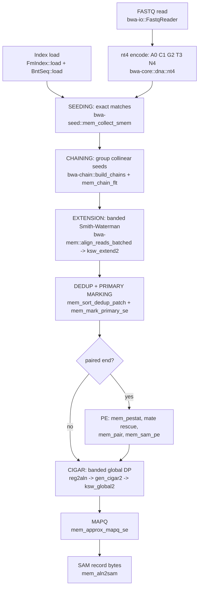

# ARCHITECTURE

A guide to this codebase for a programmer who knows nothing about biology, read alignment, or bwa.

Everything below is checkable: file paths and function names are cited so you can go read the
source. The code carries unusually detailed comments, and this document is a map into them, not a
replacement for them. Where a claim could not be verified in the code, it is marked UNVERIFIED.

---

## 1. The problem, in plain English

### The data

A **reference genome** is one very long string over the alphabet `{A, C, G, T}`. For a human it is
about 3.1 billion characters, split into 24-ish named pieces called **contigs** (chromosomes, plus
smaller unplaced fragments). Concatenated end to end with a table saying where each piece starts,
it is a single 3.1-Gbase string. In this codebase that concatenated string is the **pac** (packed
reference, 2 bits per base) and the table of contig names and offsets is the **BntSeq**
(`crates/bwa-index/src/bntseq.rs`).

A **read** is a short string over the same alphabet, typically 100 to 250 characters, produced by a
DNA sequencing machine. A machine run produces hundreds of millions of them. They arrive in a
**FASTQ** file: for each read, a name, the base string, and a per-character quality score.

An **alignment** is the answer to: where in the reference genome did this read come from, and how
does it line up there, character by character? The output format is **SAM**, one text line per
read, giving the contig name, the position, and a compact edit script called a **CIGAR**.

So the whole job is: locate 350 million short strings inside one 3-billion-character string, and
say precisely how each one matches. That is the entire program.

### Why it is not just string search

If reads were exact substrings of the reference, this would be a solved problem: build a suffix
array, done. Three things break that.

1. **Biological variation.** The individual being sequenced is not the reference individual. Their
   genome differs at millions of positions: single-character substitutions, and **indels**
   (insertions and deletions, where the read has characters the reference lacks or vice versa).
2. **Sequencing errors.** The machine miscalls characters at a rate around 0.1 to 1 percent. On a
   150-character read that is often at least one wrong character.
3. **Repeats.** The genome is full of near-identical repeated regions. A read from a repeat matches
   many places roughly equally well, and the aligner has to say so rather than pick one and pretend
   to be sure. That is what **MAPQ** (mapping quality) is for.

So the aligner needs *approximate* matching: find the position maximizing an alignment score, where
a matching character earns `+a`, a mismatch costs `-b`, and a gap of length `k` costs `o + k*e`.
Finding that optimum by dynamic programming (Smith-Waterman) against the whole genome would be
about 3 billion times 150 cells per read. Utterly impossible at 350 million reads.

### The way out: seed and extend

The strategy every modern short-read aligner uses, and the one implemented here:

- **Seed.** Find short *exact* matches between the read and the genome, using an index that answers
  exact-substring queries in time proportional to the pattern length, not the genome length. These
  pin the read to a handful of candidate loci instead of 3 billion.
- **Chain.** Group seeds that are consistent with one alignment (increasing together in both read
  and reference coordinates).
- **Extend.** Run the expensive dynamic programming only in a narrow band around each chain.

The exact-match index is an **FM-index** (see the glossary and
`crates/bwa-index/src/fmindex.rs`). Its module comment states the idea in four lines: sort every
suffix of the text, and any pattern then occupies one contiguous range of rows in that sorted list,
so "how many times does this pattern occur" is just the range's size.

---

## 2. Why byte-identical output is the goal, and what it costs

This project is a from-scratch Rust reimplementation of the C++ aligner **bwa-mem2**, vendored for
reference at `reference/bwa-mem2/src/`. No FFI, no linking the C++.

The acceptance criterion, stated in `CONTRIBUTING.md`, is not "produces good alignments" or "agrees
statistically". It is: **for the same index and the same input, emit the same SAM bytes as the
oracle binary**, down to the last character of the last tag. The oracle is a specific patched build
(bwa-mem2 v2.3 at rev `7aa5ff6c` plus two patches, built with sse2neon on arm64). The only
sanctioned difference is the `@PG` header line, which legitimately carries each tool's own name and
command line (`DIVERGENCES.md`).

Why this bar? Because it is the only criterion that is objectively falsifiable. "Close enough"
alignment output cannot be tested; identical bytes can, by `cmp`. It also means the port can be
dropped into an existing analysis pipeline without revalidating everything downstream.

The cost is that **every bug, quirk and accident in the C is part of the specification.** You cannot
fix anything. Concretely, from this codebase:

### Example A: f32 versus f64, and the constants that must stay single-precision

`crates/bwa-mem/src/primary.rs:30` declares:

```rust
const PATCH_MAX_R_BW: f32 = 0.05;
```

with a comment explaining exactly why. The C writes `0.05f`, a `float` literal, and compares it
against a `double`. The usual arithmetic conversions promote the literal, so the threshold the C
actually applies is `(double)0.05f` = 0.05000000074505806, not 0.05. Writing `0.05_f64` in Rust
makes the threshold about 7.5e-10 *smaller*, so a value landing in that sliver would be accepted by
the C and rejected here, dropping an alignment merge that bwa performs. The same file notes
`PATCH_MIN_SC_RATIO` has a 32x wider gap: `(double)0.90f` is 0.89999997615814209.

The same class of bug appears at `primary.rs:197` for `mask_level_redun` (0.95f), where the comment
works out the arithmetic: f32 rounds `0.95f * 40` back up to exactly 38.0, so `38 > 38.0` is false
and the hit is kept, while f64 keeps 37.99999952, so `38 > that` is true and the hit is dropped.
One alignment's fate per boundary case.

### Example B: `mapQ_coef_fac` is an `int` in the C

Documented in `DIVERGENCES.md` and enforced by a test at `primary.rs:577`. bwa-mem2 computes
`o->mapQ_coef_fac = (int)log(50)`, which truncates to `3`, not `3.912`. Storing the mathematically
correct `ln(50)` gives MAPQ 15 where the oracle gives 8. That single truncation accounted for 23
single-end and 6 paired-end divergent records. The fix was to store the truncated integer:
`MemOpt::mapq_coef_fac = (50.0_f64.ln() as i32) as f64` in `crates/bwa-core/src/opt.rs`.

Relatedly, `primary.rs` and `cigar.rs` are littered with `+ 0.499` before an `as i32` truncation.
That is bwa's round-to-nearest idiom, and it is 0.499 rather than 0.5 on purpose, so a value with
fractional part exactly 0.5 rounds *down*. "Fixing" it to 0.5 shifts scores by one at every tie.

### Example C: unstable sorts, where the instability is load-bearing

bwa sorts with klib's `ks_introsort`, which is **unstable**. In `mem_sort_dedup_patch`
(`primary.rs:204`) the sort key is the reference end coordinate `re` *alone*. Ties are common, and
the redundancy test that follows drops the earlier entry whenever scores tie. So the permutation
chosen among equal-`re` regions decides which alignment survives into the SAM. A stable sort
silently picks a different one.

The project therefore ports `ks_introsort` faithfully (median-of-3 quicksort with a combsort
fallback and a final insertion sort) as `bwa_chain::ks_introsort_by`. Per `DIVERGENCES.md`, the
combination of chain ordering plus this unstable sort in `mem_chain_flt` was root cause number one
of the parity work, accounting for 340 single-end and 622 paired-end divergent records.

Where bwa *does* make its sort total, the code says so. `mem_mark_primary_se` (`primary.rs:445`)
sorts by `(score, is_alt, hash)`, and the comment notes the hash key is what makes the unstable sort
harmless there, because no ties are left for instability to resolve.

### Example D: integer overflow and wraparound emulated on purpose

`hash_64` (`primary.rs:154`) is Thomas Wang's 64-bit mixer, written with `wrapping_add` throughout
because the C relies on `uint64_t` wraparound, which is defined behavior in C but panics in a Rust
debug build. Its whole purpose is to be a deterministic tie-break: two equal-scoring alignments get
an arbitrary but *reproducible* order that does not depend on thread count or batch boundaries.

Similarly, seed ordering in `mem_chain2aln_meta` (`crates/bwa-mem/src/lib.rs:310`) reproduces the
C's `(uint64_t)score << 32 | i` packing including the `score as u32` cast, which reinterprets a
signed score into the high half of an unsigned key.

### Example E: the order of random number draws is part of the file format

The reference contains `N` characters (unknown bases). The index builder replaces each one with a
*random* ACGT base, drawn from glibc's `lrand48` seeded with 11. `crates/bwa-index/src/build.rs`
comments that the seed must be 11 and the generator must be glibc's exactly, "or every N in the
reference gets a different random replacement base and `.pac`/`.0123`/the whole FM index diverge
byte-wise". `crates/bwa-index/src/rand48.rs` therefore reimplements `lrand48`, with a test
(`matches_libc_lrand48_seed11`) pinning it.

Worse, the *order* of the draws is load-bearing. The C draws one `lrand48()` per ambiguous base, in
reference order, in the same pass that records the ambiguity runs. Drawing them in a different
order, or drawing one extra, shifts the whole random stream and changes every later `N`'s
replacement. That is why that one loop in `build.rs` is strictly sequential while the passes around
it are parallelized.

### Example F: two Smith-Waterman kernels with deliberately opposite conventions

`ksw_extend2` (seed extension) opens gaps from `M`, the diagonal score, not from
`h = max(M, E, F)`. The C says why at `ksw.cpp:487`: opening from `H` would permit a CIGAR like
`100M3I3D20M`, an insertion abutting a deletion for free.

The mate-rescue kernel does the opposite. `ksw_local_fwd` ports `ksw_u8`, whose striped SIMD
formulation subtracts from `h` (`ksw.cpp:168`). So the rescue SW really does open gaps from `H`.
`crates/bwa-extend/src/sw.rs:27` states the rule: that asymmetry is upstream's, it is not a bug
here, and "fixing" it would change rescue scores and break byte-identity. Each kernel mirrors its
own original, and neither convention is the right one.

Section 6 tells the rest of this story: this exact distinction was violated in a GPU shader backend and
the acceptance gate was structurally unable to see it.

### The general shape

Faithfulness sometimes runs the other way too: the code widens where widening provably cannot
change output, and says so. `cal_max_gap` (`lib.rs:120`) promotes to `f64` before multiplying where
the C multiplies in `int`, with a comment proving the two agree for every reachable `qlen`. That is
the standard to hold: either match the C exactly, or prove in a comment that the difference is
unreachable.

---

## 3. The pipeline, end to end, following one read

```
FASTQ record  ──▶ nt4 codes  ──▶ SMEMs ──▶ seeds ──▶ chains ──▶ regions ──▶ alignments ──▶ SAM line
                    (0..4)      (k,l,s)   (q,r,len)  collinear   scored     CIGAR+MAPQ      text
```

Full stage diagram:



### 3.0 Index load

**In:** a path prefix, e.g. `/data/hg38.fa`, with five files next to it produced by
`bwa-mem4 index` (or byte-identically by `bwa-mem2 index`): `.pac`, `.ann`, `.amb`,
`.bwt.2bit.64`, `.0123`.

**Out:** two in-memory structures.

- `FmIndex::load` (`crates/bwa-index/src/fmindex.rs`) reads `.bwt.2bit.64` (checkpointed occurrence
  counts plus a compressed suffix array) and `.0123` (the forward-plus-reverse-complement reference,
  one byte per base). It is memory-mapped, which is where the RSS savings noted in the project's
  perf work come from.
- `BntSeq::load` (`crates/bwa-index/src/bntseq.rs`) parses the two text files `.ann` and `.amb`:
  the contig dictionary (name, offset, length per contig) and the list of ambiguous-base runs.

**Called from:** `crates/bwa-cli/src/cmd_mem.rs::run`.

The index build side lives in `crates/bwa-index/src/build.rs` and `sais.rs` (a from-scratch SA-IS
suffix array construction), driven by `crates/bwa-cli/src/cmd_index.rs`. It is itself held to
byte-identity against `bwa-mem2 index` (`scripts/index_diff.sh`,
`crates/bwa-index/tests/index_byte_identity.rs`).

**Coordinate spaces, read this before anything else.** The FM index searches a text of length
`2 * l_pac`: the forward genome followed by its reverse complement. This is called **2L space**.
A position `>= l_pac` therefore *means* "reverse strand", which is why the code tests
`rb < l_pac` instead of carrying a separate strand flag. `BntSeq::depos` folds a 2L coordinate back
onto the forward strand and returns the strand bit. Seeds, chains, and extension windows all live
in 2L space; SAM POS is derived from forward space. See the module comment at
`crates/bwa-index/src/bntseq.rs:19`.

### 3.1 Read input and encoding

**In:** a FASTQ file (or two, for paired end). **Out:** `Record` values with name, sequence, quality.

`crates/bwa-io/src/fastq.rs` streams reads in fixed-size batches. The batch size is bwa's `-K`
option, and fixing it is what makes output independent of thread count: the driver in `cmd_mem.rs`
assigns each read a *global* id (`base_id + i`) that feeds the hash tie-breaker, so batching and
threading cannot perturb the SAM.

Sequences are converted from ASCII to **nt4 codes** by `bwa_core::dna::nt4`: `A=0 C=1 G=2 T=3`, and
`4` for `N` or any other character. Everything downstream works on codes, never ASCII.

### 3.2 Seeding: from a read to exact matches

**In:** the read as nt4 codes, plus the `FmIndex`. **Out:** a `Vec<MemSeed>`, each a triple
`(qbeg, rbeg, len)`: this read offset matches this 2L reference offset for this many bases.

**Entry point:** `bwa_seed::mem_collect_smem` (`crates/bwa-seed/src/lib.rs`). Its module comment is
the best introduction to the FM index in the repo; read it before touching seeding.

An **SMEM** (super-maximal exact match) is, informally, the longest exact match covering each read
position. Formally: a maximal exact match not contained in another maximal exact match of the same
read. Reporting only SMEMs keeps the seed set small without losing loci.

The FM index represents a match as an interval `(k, l, s)`: `k` is the first BWT row matching the
pattern, `l` the first row matching its reverse complement, `s` the number of occurrences.
`FmIndex::backward_ext` grows the pattern one character to the *left* in O(1), using two occurrence
counts. There is no separate forward index: appending on the right is done by swapping `k` and `l`
(reinterpreting the interval as the reverse complement's) and prepending the complement base
`3 - c`. That swap dance is all over `bwa-seed`.

Seeding runs in **three rounds** (documented at `crates/bwa-seed/src/lib.rs:56`):

1. All-position SMEMs with `min_intv = 1`: accept any pattern that occurs at all.
2. **Re-seeding**: every round-1 SMEM that is long (`>= split_len`) but not repetitive
   (`s <= split_width`) is searched again *from its midpoint*, demanding strictly more occurrences
   than its parent. This recovers seeds a single long SMEM swallowed.
3. Forward-only seeding capped by `max_mem_intv`, which rescues short reads and repetitive regions.

Each SMEM is then resolved into actual coordinates by `FmIndex::get_sa`, which turns a BWT row
number into a reference position. An SMEM with `s` occurrences yields up to `max_occ` seeds (bwa's
`-c`, default 500). Note `seeds_from_smem` does not take the *first* `max_occ` rows when `s`
exceeds the cap: it *strides* by `step = s / max_occ`, so the sample is spread across the interval.
The fraction of the read covered by SMEMs too repetitive to sample fully becomes
`frac_rep`, which later drags MAPQ down.

Performance note recorded in the module comment: this stage is pure pointer chasing with no
instruction-level parallelism within one read, so the code keeps `N = 16` independent walks in
flight round-robin with prefetch (the "lockstep" design). A consequence noted there: several
published "fewer memory accesses" FM-index optimizations measure as no gain here, because the
latency they remove is already hidden.

### 3.3 Chaining: from seeds to candidate loci

**In:** the read's seeds. **Out:** a `Vec<MemChain>`, each a run of collinear seeds plus a weight
and a keep/drop verdict.

**Entry points:** `bwa_chain::build_chains` then `bwa_chain::mem_chain_flt`
(`crates/bwa-chain/src/lib.rs`).

Seeding hands over tens to hundreds of seeds per read, scattered over every repeat copy and every
spurious short hit. A real alignment is not one seed, it is a run of seeds increasing together in
read and reference coordinate at roughly the same rate, small differences being indels. That run is
a **chain**.

The pass is a single greedy sweep. Seeds arrive in read order; each is offered to exactly *one*
existing chain (the one whose start position is closest at or below the seed's) via
`test_and_merge` (`lib.rs:105`), and if that chain refuses, the seed starts a new chain. There is no
optimal-chaining dynamic program here, unlike minimap2.

"The chain whose start position is closest at or below" is looked up in a hand-ported klib
**kbtree** (`crates/bwa-chain/src/kbtree.rs`) keyed on chain position alone, so duplicate keys are
permitted, and which chain the lookup returns when several start at the same position depends on
klib's node layout and split history. That is observable in the output, which is why the B-tree is
ported rather than replaced with a `BTreeMap`.

`mem_chain_weight` (`lib.rs:150`) scores a chain as the min of its non-overlapping query coverage
and its non-overlapping reference coverage, in bases. `mem_chain_flt` then drops chains dominated by
better overlapping ones, using the ported unstable introsort discussed in section 2.

### 3.4 Extension: from chains to scored regions

**In:** the read codes, a chain, the packed reference. **Out:** `MemAlnReg` values, one per seed of
the chain: a scored alignment region with reference span `[rb, re)`, query span `[qb, qe)`, a score,
and the bookkeeping MAPQ will need.

**Entry points:**
- Scalar, one read at a time: `bwa_mem::mem_chain2aln` / `mem_chain2aln_meta`
  (`crates/bwa-mem/src/lib.rs:218`).
- Batched, the production path: `bwa_mem::align_reads_batched`
  (`crates/bwa-mem/src/across.rs:412`), a port of bwa-mem2's
  `mem_chain2aln_across_reads_V2`.
- The DP kernel itself: `bwa_extend::ksw_extend2` (`crates/bwa-extend/src/sw.rs:120`), with a
  vectorized equivalent in `crates/bwa-neon/src/batched.rs`.

For each seed, the code extends **left** and then **right** from the seed, each direction a banded
local Smith-Waterman. Left extension reverses both sequences so the DP can always run left to right;
that is why its results are then *subtracted* from the seed's start.

The two extensions compose because the right one starts with `h0 = a.score`, the score already
banked by the seed plus the left extension. That single parameter is what turns two independent DPs
into one alignment score.

Each extension returns (see `SideResult`, `lib.rs:129`):
- `score`: the best local score, i.e. free to soft-clip the rest of the read.
- `qle` / `tle`: query and target lengths consumed at that optimum.
- `gscore` / `gtle`: the best score that reaches the *end of the query*, and the reference length it
  consumed.

The clip-or-extend decision is then `if gscore <= 0 || gscore <= score - pen_clip { clip } else
{ extend to end }`, written so that ties take the clipped branch, exactly as the C orders it.

The band is not fixed. `extend_side` (`lib.rs:180`) implements bwa's `MAX_BAND_TRY` loop: run at
band `opt.w`, accept if widening bought nothing or if the optimum sat well inside the band
(`max_off < (w>>1) + (w>>2)`), otherwise double the band and re-run, at most twice. The accepted
band is stored on the region and reused later for CIGAR generation.

Two other guards matter:
- The reference window for a chain is widened by `cal_max_gap` on each side, clamped so it never
  straddles `l_pac` (which would splice the forward strand onto the reverse), then trimmed to the
  seed's contig so extension cannot run into the next chromosome.
- **Z-drop** (`opt.zdrop`, bwa's `-d`): the DP abandons a row once the running score has fallen
  `zdrop` below the best seen, corrected for diagonal drift. This stops an alignment from running
  through a long junk region to reach a distant good patch.

Inside the kernel, two details are worth knowing before you touch it. Gaps open from `M`, the
diagonal score, never from `h = max(M, E, F)` (see section 2, example F). And a zero in the score
arrays means "no alignment reaches this cell", not "score zero", which is why the inner loop tests
`big_m != 0` before adding a substitution score. Unreachable cells carry `MINUS_INF = -0x40000000`,
a quarter of the way up from `i32::MIN` specifically so repeated gap subtractions cannot wrap.

After every chain of the read has been extended, a **discard pass**
(`across::discard_contained`, gated by `across::discard_enabled`) purges regions whose seed was
already covered, by marking them `qb = qe = -1`; `align_read` (`lib.rs:518`) then compacts with
`retain(|a| a.qe > a.qb)`. The compaction must happen before the next sort, because dead entries
participating in an unstable sort would perturb the order of the live ones.

### 3.5 Dedup, primary marking, MAPQ

**In:** the read's raw regions. **Out:** a deduplicated, ranked region list with `sub`, `sub_n` and
`secondary` filled in.

**Entry points** (all `crates/bwa-mem/src/primary.rs`):
- `mem_sort_dedup_patch` (`:183`): three passes. Sort by reference end; for each region look
  backwards at anything that could still overlap, killing the lower-scoring member of a heavily
  overlapping pair and offering merely-collinear pairs to `mem_patch_reg` for merging into one
  long-indel or split alignment. Then compact, re-sort by score, and drop exact duplicates.
- `mem_mark_primary_se` (`:405`): sort by `(score desc, is_alt asc, hash asc)`, then greedily sweep.
  Region 0 is primary. Each later region that overlaps an existing primary by at least `mask_level`
  (0.5) of the shorter region *on the query axis* becomes that primary's **secondary**; otherwise it
  becomes a primary itself. Along the way it sets `sub` (the best competing score) and `sub_n` (how
  many competitors are within one mismatch or one 1bp indel of the primary).
- `mem_approx_mapq_se` (`:466`): turns that into a phred-scaled confidence 0 to 60. Driven by the
  margin `score - sub`, scaled by a fractional identity term entering to the *fourth* power, a
  length discount, a `-10*log10(sub_n + 1)` penalty for crowded runner-up fields, and finally scaled
  by `1 - frac_rep` so a read whose seeds were all repeats gets MAPQ 0 no matter how clean it looked.

### 3.6 Paired-end: insert size, mate rescue, pairing

Skipped entirely for single-end input. All in `crates/bwa-mem/src/pe.rs` (2067 lines, the largest
file in the repo), driven by `cmd_mem::run_pe`.

Reads come in pairs from two ends of the same DNA fragment, so their genomic positions are
correlated. Exploiting that is worth a lot of accuracy.

1. **`mem_pestat` (`pe.rs:864`).** Once per read batch, estimate the insert-size distribution from
   pairs where both ends map near-uniquely (second-best at most 80% of best). Four orientations are
   tracked (FF, FR, RF, RR); an orientation with under 10 supporting pairs, or under 5% of the
   most-populated orientation's count, is declared `failed` and never used. Outputs mean, standard
   deviation and a proper-pair window per orientation. Because it is per batch, one difference in
   these five numbers moves every pair in the batch.

2. **Mate rescue (`mem_matesw`, `pe.rs:201`; batched as `batch_mate_rescue`, `pe.rs:664`).**
   Seeding can miss a mate entirely. If the other end is confidently placed, the insert-size
   distribution says within a few hundred bases where the mate must be, so a full local
   Smith-Waterman (`bwa_extend::ksw_align2`) over that small window finds it. On real data this is
   roughly 47% of paired-end wall time, which is why it has its own vectorized kernel
   (`crates/bwa-neon/src/matesw.rs`) and its own kill switch (`-S`, or `BWA4_NO_RESCUE`).

3. **`mem_pair` (`pe.rs:1042`).** Build one flat list of every candidate placement from both reads,
   packed into two `u64`s so a plain sort orders them by genomic position, then sweep left to right.
   For each placement, look back at recent placements of the *other* read on a compatible strand at
   a plausible distance, and score each candidate pair as (sum of alignment scores) plus an
   insert-size log-likelihood term. Best pair wins.

4. **`mem_sam_pe` (`pe.rs:1693`).** Orchestrates the above, decides paired versus unpaired output
   (`-P` skips pairing entirely), and emits both records.

### 3.7 CIGAR generation

**In:** a chosen region and the read codes. **Out:** a `MemAln` with a CIGAR, `NM`, `MD`, position
and MAPQ.

**Entry point:** `bwa_mem::reg2aln` (`crates/bwa-mem/src/cigar.rs:289`), calling
`gen_cigar2` (`:135`), calling `bwa_extend::ksw_global2`.

Extension produced only end points and a score. This is where a base-level alignment is
materialized, by running a banded **global** (Needleman-Wunsch) alignment between those now-fixed
end points. Global, not local, is the point: the ends are already decided, so the only remaining
question is how the interior lines up.

The band comes from `infer_bw` (`:101`), which bounds how far off the diagonal the alignment could
stray given the score deficit, and then a retry loop doubles the band up to three more times while
the global score falls meaningfully short of the local one.

Post-processing, in order: squeeze a leading or trailing deletion (a `D` at either edge asserts
reference bases outside the aligned span, which is meaningless in SAM); a leading `D` is absorbed by
advancing POS, a trailing one is dropped. Note this is an `else if`, so a CIGAR flanked by `D` at
both ends keeps its trailing `D`. That is bwa's behavior, deliberately preserved. Then soft-clips
are added for the unaligned read ends, with the 5' and 3' clips swapped on reverse-strand hits
because CIGAR is written along the reference while `qb`/`qe` are in read orientation.

`NM` and `MD` are computed by walking the CIGAR inside `gen_cigar2`.

### 3.8 SAM output

**In:** the finalized alignments for a read (and its mate). **Out:** bytes.

**Entry points:** `bwa_io::sam::write_header` for the `@SQ`/`@RG`/`@PG` header
(`crates/bwa-io/src/sam.rs`), and `mem_aln2sam` (`crates/bwa-mem/src/pe.rs:1317`) for records, with
`mem_reg2sam` (`:1592`) deciding which regions become records at all.

Assembles the eleven mandatory SAM fields plus tags (`NM`, `MD`, `AS`, `XS`, `SA`, `XA`, `MC`,
`RG`). FLAG bits are computed here: 0x1 paired, 0x4 this read unmapped, 0x8 mate unmapped, 0x10
this read reverse, 0x20 mate reverse, 0x100 secondary, 0x800 supplementary. An unmapped read is
written at *its mate's* coordinate with an empty CIGAR rather than at `*`/0, which is what lets a
coordinate sort keep the pair together. `XA:Z` alternate hits come from
`crates/bwa-mem/src/alt.rs::mem_gen_alt`.

Note the internal bit `0x10000` used under `-M`: it means "supplementary, but report it as
secondary", and it is masked off and translated to the real SAM 0x100 at emission time.

---

## 4. Crate map

Twelve crates under `crates/`, about 21,000 lines. Dependency direction is strictly downward in this
table (nothing depends on something listed above it, except `bwa-cli` which depends on most of it).

| Crate | Responsibility | Depends on |
|---|---|---|
| `bwa-core` | `MemOpt` (every alignment option, with the exact `mem_opt_init` defaults and per-option docs), the `MEM_F_*` flag bits, nt4 encoding tables (`dna.rs`), `@RG` handling (`rg.rs`), error type | `thiserror` only |
| `bwa-io` | FASTQ reading with fixed `-K` batching (`fastq.rs`), SAM header and record writing (`sam.rs`) | `bwa-core`, `needletail` |
| `bwa-index` | Index build (SA-IS suffix array in `sais.rs`, on-disk layout in `build.rs`) and load; FM-index traversal `get_occ` / `backward_ext` / `get_sa` (`fmindex.rs`); contig dictionary and coordinate conversion (`bntseq.rs`); 2-bit pac access (`packed.rs`). `lisa.rs` and `rmi.rs` are an abandoned learned-index experiment (see below) | `bwa-core`, `rayon`, `memmap2` |
| `bwa-seed` | SMEM collection and the three seeding rounds; converts FM intervals to reference-coordinate seeds. `lisa_seed.rs` is the abandoned experiment's seeding half | `bwa-core`, `bwa-index` |
| `bwa-chain` | Greedy seed chaining, chain weighting and filtering; the ported klib `kbtree` and the ported unstable `ks_introsort` (used repo-wide) | `bwa-core`, `bwa-index`, `bwa-seed` |
| `bwa-extend` | The scalar Smith-Waterman kernels: `ksw_extend2` (banded local extension), `ksw_global2` (banded global, for CIGARs), `ksw_align2` / `ksw_local_fwd` (mate rescue). Defines the `SwBackend` trait and the two acceptance harnesses that every accelerated backend must pass | nothing |
| `bwa-neon` | Vectorized backends, NEON on AArch64 and AVX2 on x86_64. `batched.rs` bins jobs by provable score bound into u8 (16/32 lane) and i16 (8/16 lane) kernels with a scalar fallback, plus an ungapped fast path; `matesw.rs` does the same for mate-rescue local SW. Note the single-alignment `extend` deliberately delegates to scalar: one alignment has no lanes to fill | `bwa-extend` |
| `bwa-mem` | The alignment core and pipeline glue: extension driver (`lib.rs`, `across.rs`), dedup / primary marking / MAPQ (`primary.rs`), CIGAR / NM / MD (`cigar.rs`), all paired-end logic (`pe.rs`), `XA` generation (`alt.rs`) | `bwa-core`, `bwa-index`, `bwa-seed`, `bwa-chain`, `bwa-extend`, `bwa-neon` |
| `bwa-cli` | The `bwa-mem4` binary: `index` and `mem` subcommands, option parsing and validation (`cmd_mem.rs`, 1484 lines, half of it per-option documentation), the threaded read/process/write pipeline | most of the above, `clap`, `rayon`, `bgzf`, `mimalloc` |
| `bwa-diff` | The `sam-diff` binary: field-level SAM concordance reporting, so a divergence reads as "37 records differ in XA" rather than as a byte offset. Deliberately lossy (five fields, primaries only, order-insensitive), so a clean report is **not** proof of parity | `serde`, `serde_json` |

`bwa-sam` was an empty placeholder crate, reserved early for primary marking / MAPQ / CIGAR / tags
before that work ended up next to the code it needs. It was removed for 4.0.0: it held no code and
nothing depended on it, and shipping an empty crate in a release is noise in every `cargo tree`.

**Dead ends kept in tree.** `bwa-index/src/lisa.rs`, `rmi.rs` and `bwa-seed/src/lisa_seed.rs` are a
byte-identical implementation of BWA-MEME's learned-index seeding. Per the project's own notes it
was proven to produce identical results on the genome and measured roughly 50x *slower* than the
FM-index. It is kept as a record, not as a live path. Do not resurrect it without reading that
history.

---

## 5. Glossary

Terms and short variable names you will hit constantly, with what they *mean*.

### Data and coordinates

- **reference / genome.** The known DNA string a read is located against. Human: about 3.1 billion
  characters over `{A,C,G,T}`, plus `N` for unknown.
- **contig.** One named piece of the reference (a chromosome or fragment). Becomes a SAM `@SQ` line
  and the RNAME column.
- **read.** One short string produced by a sequencer, 100 to 250 characters typically.
- **pac.** The **pac**ked reference: the whole genome concatenated, 2 bits per base, in
  `<prefix>.pac`. The `.0123` file is the same content one byte per base.
- **l_pac.** The length in bases of the *forward* packed reference, i.e. the sum of all contig
  lengths. Not the index's search length, which is `2 * l_pac`.
- **2L space.** The coordinate space `[0, 2*l_pac)` the FM index actually searches: forward genome
  followed by its reverse complement. A coordinate `>= l_pac` *is* a reverse-strand hit, so strand is
  a property of the number, not a separate flag. Seeds, chains and extension windows live here.
- **BNS / bntseq.** bwa's reference-metadata structure (`Bio Nucleotide Sequence`, historically).
  The contig dictionary parsed from `.ann` plus the ambiguous-base runs from `.amb`. It is the only
  thing that knows where one chromosome ends and the next begins in the undelimited pac.
- **rid.** Reference id: an index into the contig list, or `-1` for "no contig". Careful: the
  `Smem` struct also has a field named `rid`, which is a *read* index within a batch, not a contig
  id. The name is inherited from the C.
- **nt4 code.** The internal base encoding: `A=0 C=1 G=2 T=3`, `4` for `N` or anything else. Not
  ASCII. The complement of code `c` is `3 - c`, which is why that expression is everywhere.
- **ALT contig.** An *alternate* contig: a second representation of a locus that is genuinely
  polymorphic in the population, shipped alongside the primary assembly. A hit on one is not real
  evidence of ambiguity, so it is suppressed from primary consideration and does not dilute a
  primary hit's MAPQ. Which contigs are ALT comes from an optional `<prefix>.alt` file listing
  their names, read at load time (never from the index itself, so the same index behaves
  differently depending on whether that file sits next to it). The ALT-specific branches ARE
  ported: `BntSeq::apply_alt` reads the file, `mem_mark_primary_se` runs its `n_pri < n` branch
  (re-sorting so the primary assembly forms a prefix and re-marking within it), an ALT contig's
  `@SQ` line carries `AH:*`, a shadowed primary hit gets a `pa:f` tag, and the paired branch emits
  the best ALT hit as a supplementary record. `mem -j` clears every flag, making the run behave as
  though no `.alt` existed. The committed fixtures have no ALT contigs, so `scripts/alt_parity.sh`
  (manual, real GRCh38 analysis set) is what actually exercises all of this.

### The index

- **BWT.** Burrows-Wheeler Transform. Sort every suffix of the text; the BWT is the character just
  *before* each of those suffixes, read off in that sorted order. Its useful property: any pattern
  occupies one contiguous range of rows.
- **SA.** Suffix Array. `sa[i]` is the starting position in the text of the `i`-th smallest suffix.
  Turning a BWT row number back into a genome coordinate means looking it up here (`get_sa`). Stored
  compressed, so a lookup costs several dependent cache misses, which is why it shows up so heavily
  in this project's profiles.
- **occ.** The occurrence function `occ(c, p)`: how many times character `c` appears in the first
  `p` characters of the BWT. It is the one primitive that makes the search step O(1). Storing it for
  every `(c, p)` would cost more than the genome, so bwa-mem2 checkpoints it every 64 rows and
  recovers the remainder with a popcount over a bitmap. That is why `fmindex.rs` is full of `>> 6`
  and `& 63`.
- **FM-index.** The BWT plus the `occ` checkpoints plus a sampled SA: a structure answering "where
  does pattern P occur" in time proportional to `|P|`, independent of genome size. bwa's is
  *bidirectional* (an "FMD index"): it tracks the interval of the pattern and of its reverse
  complement simultaneously, which is what lets it extend a match in both directions with one index.
- **(k, l, s).** An FM interval. `k` = first BWT row matching the pattern; `l` = first row matching
  its reverse complement; `s` = the range size, i.e. the number of occurrences. `s == 0` means no
  match. `s` never grows under extension.

### Seeding and chaining

- **seed.** One *occurrence* of an exact match, resolved to coordinates: `(qbeg, rbeg, len)` = read
  offset, 2L reference offset, length. An SMEM with `s` occurrences yields up to `max_occ` seeds.
- **SMEM.** Super-Maximal Exact Match. A read substring that occurs in the reference, cannot be
  extended left or right without losing all occurrences (that makes it *maximal*), and is not
  contained in another such match of the same read (that makes it *super*-maximal). Intuitively: the
  longest exact match covering each read position.
- **min_seed_len.** bwa's `-k`, default 19. Matches shorter than this are not worth chasing; a
  19-mer is long enough to be rare in 3 billion bases.
- **max_occ.** bwa's `-c`, default 500. An SMEM occurring more often than this is too repetitive to
  resolve, so only a sample of its occurrences becomes seeds.
- **split_width.** The occurrence-count ceiling above which a round-1 SMEM is considered too
  repetitive to bother re-seeding (round 2).
- **chain.** A run of collinear seeds: increasing together in read and reference coordinate at
  roughly the same rate, small differences being indels. One chain is one candidate alignment locus.
- **frac_rep.** Fraction of the read covered by SMEMs too repetitive to sample fully. Read-wide, so
  every chain of a read carries the same value. It scales MAPQ down at the very end.

### Extension and scoring

- **Smith-Waterman.** The dynamic program for optimal *local* alignment: best-scoring pair of
  substrings, free to start and end anywhere. Needleman-Wunsch is the *global* variant, forced to
  span both sequences end to end. Extension uses the former, CIGAR generation the latter.
- **band / band width.** The DP only computes cells within `|i - j| <= w` of the main diagonal.
  bwa's `-w`, default 100. A banded DP is linear rather than quadratic, but it can only find gaps
  that fit inside the band, which is why `extend_side` doubles the band and retries.
- **h0.** The score the DP starts from, i.e. what has already been banked. For a left extension it
  is `seed_len * a`; for the right extension it is the score after the left one. Passing `h0` is
  what composes two one-sided DPs into a single alignment score.
- **qle / tle.** Query Length to End / Target Length to End: how many query and reference bases the
  optimal *local* alignment consumed. Subtracted from the seed's start for a left extension, added
  for a right one.
- **gscore / gtle.** The best score reaching the *end of the query* (global in the query, local in
  the reference), and the reference length it consumed. The clip-versus-extend decision compares
  `gscore` against `score - pen_clip`.
- **pen_clip5 / pen_clip3.** bwa's `-L`, default 5,5. The penalty for soft-clipping the read's 5' or
  3' end. Note the double duty flagged at `lib.rs:171`: the same number is handed to the DP as an
  `end_bonus` (a clip is modeled as forgoing a bonus, not as a subtracted cost) and used as a real
  penalty in the comparison above.
- **zdrop.** bwa's `-d`, default 100. Abandon the DP row once the running score falls this far below
  the best seen, corrected for diagonal drift. Stops an alignment running through junk to reach a
  distant good patch. `zdrop <= 0` disables it.
- **region (`MemAlnReg`).** One extended seed: a scored alignment candidate with reference span
  `[rb, re)` in 2L space, query span `[qb, qe)`, and its ranking bookkeeping. A read normally has
  many; dedup, primary marking and pairing collapse and rank them. Defined with per-field docs at
  `crates/bwa-mem/src/lib.rs:41`.
- **score vs truesc.** `score` is the best banded local score, the value ranked on and emitted as
  `AS`. `truesc` is the score of the alignment actually *taken*, which differs when extension chose
  to run to the query end rather than clip. Pairing scores on `truesc`; ranking uses `score`.
- **sub.** The score of the best *other* region overlapping this one: the suboptimal alignment
  score. Emitted as `XS`. It is the denominator of confidence: a primary is only trustworthy insofar
  as it beats the runner-up.
- **csub.** Chain-level suboptimal score, carried over from chaining. MAPQ takes
  `max(sub, csub)` as a second opinion.
- **sub_n.** How many near-optimal competitors exist (within one mismatch or one 1bp indel of the
  primary). Costs MAPQ `10*log10(sub_n + 1)` phred points.
- **seedcov.** Total seed length lying inside the finished region, on both axes: a proxy for how
  much of the alignment is backed by exact matches rather than DP guesswork. It counts overlapping
  seeds twice, a quirk kept because the C does it.

### Output

- **SAM.** The text alignment format. Eleven mandatory tab-separated fields per record (QNAME, FLAG,
  RNAME, POS, MAPQ, CIGAR, RNEXT, PNEXT, TLEN, SEQ, QUAL) followed by optional `TAG:TYPE:VALUE`
  tags.
- **CIGAR.** The edit script, e.g. `5S140M2D5M`. `M` = aligned (match *or* mismatch, it does not
  distinguish), `I` = insertion (bases in the read absent from the reference), `D` = deletion, `S` =
  soft clip (read bases present in SEQ but not aligned), `H` = hard clip (read bases not even
  stored). Internally packed as `len << 4 | op` with op 0=M 1=I 2=D 3=S 4=H.
- **MAPQ.** Mapping quality, 0 to 60 in bwa. Phred-scaled confidence that the *locus* is right,
  which is a different question from whether the base-level alignment is right. 0 means "this read
  maps equally well elsewhere, do not trust the position".
- **SAM FLAG.** A bitfield. 0x1 paired, 0x2 properly paired, 0x4 this read unmapped, 0x8 mate
  unmapped, 0x10 this read on the reverse strand, 0x20 mate on the reverse strand, 0x40 first in
  pair, 0x80 second in pair, 0x100 secondary, 0x800 supplementary.
- **primary / secondary / supplementary.** Each read has exactly one **primary** record, the one
  best explanation of the whole read. A **secondary** (0x100) is a competing alignment of
  substantially the same read bases somewhere else: a different answer to the same question, usually
  suppressed unless `-a` is given. A **supplementary** (0x800) is a different *part* of the same
  read aligning elsewhere: a chimeric or split alignment, where the pieces complement rather than
  compete. Supplementaries are hard-clipped by default so the read's bases appear exactly once
  across all its records; `-Y` soft-clips them instead.
- **NM / MD.** `NM:i` is the edit distance (mismatches plus total gap length). `MD:Z` encodes which
  reference bases the `M` runs actually disagreed with, so the reference is not needed to
  reconstruct them. Both are produced by `gen_cigar2`.
- **AS / XS / XA / SA / MC.** `AS:i` this alignment's score; `XS:i` the suboptimal score
  (`max(sub, csub)`); `XA:Z` a compact list of alternate hits; `SA:Z` the read's other
  supplementary alignments; `MC:Z` the mate's CIGAR.

### Paired end

- **paired-end / mate.** Both ends of one DNA fragment are sequenced, giving two reads whose
  genomic positions are correlated by the fragment length. Each is the other's **mate**.
- **insert size.** The fragment length implied by where the two ends landed.
- **pestat (`PeStat`).** The per-batch estimate of the insert-size distribution, one entry per
  orientation (FF=0, FR=1, RF=2, RR=3), each holding a mean, standard deviation, a proper-pair
  window `[low, high]`, and a `failed` flag. Estimated once per read batch by `mem_pestat` and read
  (never written) by mate rescue and pairing. See `crates/bwa-mem/src/pe.rs:50`.
- **mate rescue.** When one end is confidently placed and the other was not found by seeding, run a
  full local Smith-Waterman over the small reference window the insert-size distribution implies.
  Roughly 47% of paired-end wall time on real data.
- **proper pair.** A pair whose two ends are on the same contig, in the expected orientation, at a
  plausible distance. Sets FLAG 0x2.

---

## 6. How to work on this safely

### The standing lesson

Read the comment at `scripts/opt_parity.sh:103`. It records that `-N` was off by one chain for the
entire life of the project, because the C's `break` skips the loop header's `++i` and the port did
not: our `-N 1` hashed exactly equal to bwa-mem2's `-N 2`. Nobody noticed because no test ever
passed `-N`.

> "Same shape as the two other parity bugs found this year: the failure always sits in whatever the
> gate does not run."

The second, sharper instance is worth reading in full at `crates/bwa-extend/src/lib.rs:133`, under
the heading **"Do not narrow this sweep. It was blind once, and something got through."** The
backend acceptance gate originally pinned scoring to bwa's defaults, `(a,b) = (1,4)` and gaps
`(6,1,6,1)`. Under symmetric default penalties, `H == M` at almost every cell on the optimal path,
so the E/F recurrence's gap-open source is nearly unobservable. A backend opening gaps from
`H = max(M, E, F)` instead of from `M` therefore passed all 2000 cases while being wrong.

That is exactly what had happened. A Metal shader backend (since removed) kept `h - oe_del` after the CPU
paths were corrected, and nothing caught it, because the gate was *structurally incapable* of
generating a case that could distinguish the two. Widening the sweep over
`(a, b, o_del, e_del, o_ins, e_ins)` exposed it immediately. The corrected shader now carries a
comment headed "THE BUG THAT LIVED HERE", which went with it, told the story at
the site, so nobody simplifies those two lines back.

Note the shape of the failure: the gate was not weak, it was *blind on an axis*. A gate can run
thousands of cases and still never vary the one parameter that makes a bug observable.

That is the operating principle. Every parity bug found so far lived exactly where the test gate did
not look. So: **when you add or touch a code path, add it to a gate in the same commit.** The script
states the rule directly: every option we accept must appear in it.

The corollary applies to accelerated backends too. From `bwa-extend/src/lib.rs:155`: "A backend that
silently falls back to scalar passes vacuously. Backends must assert separately that their real
kernel was actually built and taken."

### The build gotcha, before anything else

**`cargo test --release` does not relink `target/release/bwa-mem4`.** Any differential run,
`opt_parity.sh` included, invokes that binary from disk. If you edit code, run the tests, and then
run a parity script, you are comparing the oracle against a *stale* binary and the result is
meaningless in both directions (a false pass and a false fail are equally likely).

Always:

```sh
cargo build --release      # THEN any differential script
```

(This rule is not currently written down anywhere else in the repo. It is recorded here because the
failure mode is silent.)

Two more environment traps, both from `docs/perf-levers.md`:

- **The first execution of a freshly built or copied binary on macOS is OS-validated and runs 7 to
  25 times slower.** One recorded rep: 88.0 seconds against a true 3.44. Warm every binary before
  timing it, not just the index. `bench.sh`'s median-of-3 hides this; an interleaved A/B does not.
- CPU load perturbs every benchmark script. Do not run a `cargo build` while a benchmark is in
  flight.

One piece of orientation before you optimize anything: `docs/optimization-roadmap.md` opens with a
box retracting its own central premise. The "Smith-Waterman extension is about 85% of cycles" figure
was measured on the small 2 Mbp region index, where the BWT is cache-resident. On the real genome
index, extension is roughly 22% of single-threaded wall time and seeding plus chaining are about
78%. Amdahl therefore caps every DP-kernel lever at about 1.28x. Do not start there.

### The gates that exist

**Unit and integration tests.** `cargo test --workspace`: about 73 tests across 27 modules, plus one
integration test. The pattern worth noticing is that most of them pin a *specific quirk*, not a
general property. Notable ones:

- `crates/bwa-index/tests/index_byte_identity.rs` (the only integration test): builds
  `testdata/tiny/tiny.fa` and compares all five index files against committed C-produced oracles.
  Its docs decode what each extension's failure means, down to byte offsets within
  `.bwt.2bit.64` (48-byte header, 64-byte CP_OCC blocks, `sa_ms_byte`, `sa_ls_word`, sentinel).
- `bwa-index/src/rand48.rs::matches_libc_lrand48_seed11`: the N-replacement PRNG must match glibc.
- `bwa-index/src/build.rs::amb_holes_not_merged_across_contig_boundary`: covers the gap the
  integration test declares (tiny.fa has zero ambiguous bases).
- `bwa-chain/src/kbtree.rs`: `duplicate_pos_keeps_klib_order`, `lower_picks_last_entry_below`,
  `splits_preserve_order_and_lookup`. These pin the klib tie-break semantics that decide SAM order.
- `bwa-mem/src/primary.rs::mapq_uses_truncated_int_coef_fac`: pins the `(int)log(50)` quirk to a
  specific oracle read (`_96f`, oracle MAPQ 8, float version 15).
- `bwa-mem/src/pe.rs::id_shift_matches_c_int_overflow`: pins the `int` overflow that the 30x
  paired-end divergence traced to. It only bites past pair 2^23, which is why
  `scripts/giab30x_pe.sh` exists to exercise it at full depth.
- `bwa-mem/src/across.rs::batched_across_reads_equals_per_read`: the batched extension path must
  return, per read, exactly what the scalar per-read path returns.
- `bwa-seed`: `batched_smems_equal_per_read`, `batched_full_seeding_equals_per_read`, same idea for
  seeding.
- `bwa-core/src/opt.rs::defaults_match_bwa_mem2`.

This is the shape a good regression test takes here: a real divergence, frozen.

**Backend acceptance harness.** `crates/bwa-extend/src/lib.rs` defines two functions every
`SwBackend` implementation must pass, and both are required:
- `assert_backend_matches_scalar` (`:157`): 2000 deterministic pseudo-random single alignments,
  sweeping geometry (lengths, band, zdrop, end_bonus, h0) *and* scoring (`a`, `b`, and the four gap
  parameters drawn independently, so deletion and insertion penalties usually differ). The comment
  records why the scoring sweep exists: pinning `(a,b)` to the defaults made the gate structurally
  blind to `-A/-B/-O/-E` bugs, and a real gap-versus-mismatch divergence survived there. Do not
  shrink these ranges.
- `assert_backend_batch_matches_scalar` (`:264`): catches a different failure class, **lane
  cross-talk**. Batch sizes deliberately straddle the SIMD widths in use (7/8/9 and 15/16/17) to
  exercise under-full, exactly-full and one-over vectors, with independently random per-job lengths
  so no lane sees its neighbour's geometry.

Both compare all six `ExtendResult` fields, not just the score. The harness's own documented limits
are worth knowing: sequences are uniform random DNA at most 60 bases, whereas real reads are longer
and contain satellite repeats, which is the other regime where the H-versus-M distinction bites. And
both gates draw bases with `next() % 4`, so code 4 (`N`) never appears and the ambiguity row of the
scoring matrix is never exercised, even though real reads do contain `N`. A GPU or SIMD backend
should therefore also run a read-sized gate; `bwa-neon` has one
(`neon_batch_matches_scalar_read_sized`, `metal_matches_scalar_read_sized`).

Backends additionally guard against passing *vacuously*, which is a real hazard here because every
accelerated path falls back to scalar when it cannot run:
  would make every byte-identity gate in that crate pass without the GPU ever running.
- `bwa-neon`'s `neon_verify` and `avx2_verify` modules call the SIMD kernels **directly**, bypassing
  runtime feature detection. The AVX2 one exists because Rosetta reports
  `is_x86_feature_detected!("avx2")` as false while happily executing AVX2 instructions.
- The mate-rescue gate `matesw_equals_scalar` runs twice with different scoring, chosen so that one
  run forces the u8 16-lane kernel and the other the i16 8-lane kernel.

**Per-option parity: `scripts/opt_parity.sh`.** The highest-value script in the repo. For each
bwa-mem2 option, it runs both aligners with that option and compares the alignment records byte for
byte (excluding `@PG`). An option that is parsed but not acted upon shows up as a FAIL, which is the
point. Currently it covers algorithm scalars (`-k -w -d -r -y -c -D -W -m -N -G -X -Q -s`), the full
scoring set (`-A -B -O -E -L -U -T`), output flags (`-a -M -Y -C -V -5 -q -j -h -S -P`), I/O
(`-R -I -v -H`), and the threading/batching parameters (`-t`, `-K`) which need a special mode
because clap rejects a repeated flag where getopt lets the last one win.

Two details worth copying if you write a similar script. It counts differing *records*, not bytes:
`cmp -l` compares by byte position, so a single length difference shifts the rest of the file and
reports millions of differences for a handful of bad records. And it uses
`${base[@]+"${base[@]}"}` rather than a bare array expansion, because macOS ships bash 3.2, which
treats an empty array's expansion as unbound under `set -u`, killing the shell and firing the EXIT
trap that deletes the temp directory, after which every later case "fails" against a missing
directory.

**Other scripts** (in `scripts/`):

| Script | What it does |
|---|---|
| `check.sh` | `fmt --check` + `clippy -D warnings` + `cargo test --workspace`. Must be green on every PR |
| `oracle_diff.sh` | End-to-end single-end SAM diff versus the installed `bwa-mem2`. Preflights that the oracle really is version 2.3, gates `@SQ` byte-identity, then runs `sam-diff`. Must not regress |
| `index_diff.sh` | `cmp` our five index files against `bwa-mem2 index`. Exits 0 with SKIP if `bwa-mem4 index` is a stub |
| `scale_test.sh` | Whole-chromosome gate: index byte-identity (hard fail) then paired-end concordance |
| `setup_reference.sh` | Recreates the gitignored `reference/`: clones bwa-mem2 at rev `7aa5ff6c`, downloads and sha256-verifies the two patches, applies them. This is what makes the oracle reproducible |
| `make_testdata.sh` | Builds `work/`: a chr20 slice, its index, and wgsim reads (seed 11) |
| `bench.sh` | Median-of-3 wall time and peak RSS on the small region |
| `vs_mem2.sh` | Interleaved (drift-cancelled) head-to-head, single/paired end at `-t1` and `-t8` |
| `giab_bench.sh`, `giab30x_bench.sh`, `giab30x_pe.sh` | Real-data head-to-head at increasing scale. The 30x ones pipe every timed run through `md5`, so byte-identity is verified on each pass at no extra cost, and abort if a run returns in under 30 seconds (that means the aligner errored) |
| `fetch_giab30x.sh` | Downloads about 35 GB of GIAB HG002 reads, appending gzip chunks in a fixed sorted order so pairing is preserved |
| `pe_diverge_hunt.sh`, `pe_diverge_subset.sh` | Bisect a paired-end divergence. Both categorize differences as core-field versus tag-only and flag QNAME misalignment, since any misalignment makes positional diffing invalid |
| `publication_bench.sh` | Four-phase battery (full-genome index identity, then the three benchmark scripts) writing a timestamped results log |
| `pgo.sh` | Three-stage profile-guided optimization build |

**`sam-diff`.** `crates/bwa-diff` builds a binary that reports SAM concordance field by field, so a
divergence reads as "37 records differ in `XA`" rather than as a byte offset. That framing is what
made the `mem_gen_alt` work tractable (`DIVERGENCES.md`).

### Diagnostic env vars

The code carries built-in tracing, all gated on environment variables so they cost nothing when
unset. Behaviour gates (these change output or skip work, so never leave one set during a parity
run): `BWA4_NO_RESCUE`, `BWA4_NO_DISCARD`, `BWA4_NO_SKIP_CONTAINED`, `BWA4_SCALAR_RESCUE`,
`BWA4_SEED_R2_SERIAL`, `BWA4_LOCKSTEP_N`, `BWA4_SA_SORT`, `BWA4_SA_PER_READ`.

Dumps and timers (read-only): `BWA4_DUMP_SMEMS`, `BWA4_DUMP_CHAINS`, `BWA4_DUMP_REGS`,
`BWA4_DUMP_PRESORT` (takes a read id, dumps that read's regions immediately before the hash sort,
which is where parity investigations usually start), `BWA4_DUMP_BW` (band-retry trace in bwa's
`-v 4` format, so it diffs directly against the oracle), `BWA4_DUMP_PESTAT`, `BWA4_CHAIN_TIME`,
`BWA4_MATESW_TIME`, `BWA4_TRAFFIC`, `BWA4_GPU_STATS`.

### The method that actually cracks a divergence

Recorded in `DIVERGENCES.md`: build a **bit-identical instrumented oracle**. Rebuild bwa-mem2 from
the exact patched sources (recipe reproduced in the repo's notes), verify its output is
byte-identical to the installed binary apart from `@PG`, then add dumps of internal state (SMEMs,
chains before and after `mem_chain_flt`, regions after primary marking, the inputs to
`mem_approx_mapq_se`). Diff internal state, not SAM lines. Both remaining root causes of the parity
work were found this way, and neither was visible from the SAM alone.

### Where to look to change X

| You want to change... | Go to |
|---|---|
| A command-line option's parsing or default | `crates/bwa-cli/src/cmd_mem.rs::build_opt`, and the field's doc in `crates/bwa-core/src/opt.rs` |
| How seeds are found | `crates/bwa-seed/src/lib.rs::mem_collect_smem` |
| FM-index traversal, occ, SA lookup | `crates/bwa-index/src/fmindex.rs` |
| Index file format or construction | `crates/bwa-index/src/build.rs`, `sais.rs` |
| How seeds group into candidate loci | `crates/bwa-chain/src/lib.rs` (`test_and_merge`, `mem_chain_weight`, `mem_chain_flt`) |
| The Smith-Waterman recurrence | `crates/bwa-extend/src/sw.rs`, and mirror it in `crates/bwa-neon/src/batched.rs` |
| Band widths, retry logic, z-drop behaviour | `crates/bwa-mem/src/lib.rs::extend_side`, `cal_max_gap` |
| Which alignments survive, and their ranking | `crates/bwa-mem/src/primary.rs` |
| MAPQ | `crates/bwa-mem/src/primary.rs::mem_approx_mapq_se` |
| CIGAR, NM, MD, clipping | `crates/bwa-mem/src/cigar.rs` |
| Anything paired-end | `crates/bwa-mem/src/pe.rs` |
| `XA:Z` alternate hits | `crates/bwa-mem/src/alt.rs` |
| SAM field or tag emission | `crates/bwa-mem/src/pe.rs::mem_aln2sam` (records), `crates/bwa-io/src/sam.rs` (header) |
| Threading, batching, the driver loop | `crates/bwa-cli/src/cmd_mem.rs::run` and `run_pe` |

Whatever you change, find the corresponding function in `reference/bwa-mem2/src/` first. Nearly
every function in this repo names its C counterpart and line number in its doc comment; that
cross-reference is the primary debugging tool and keeping it accurate is part of the work.
